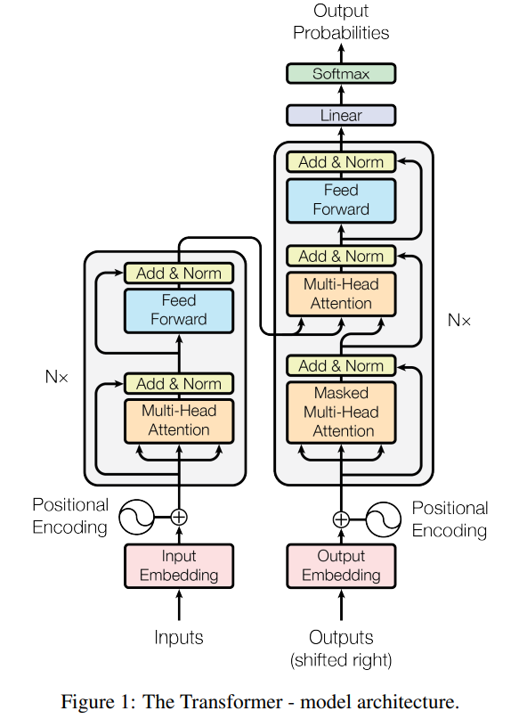
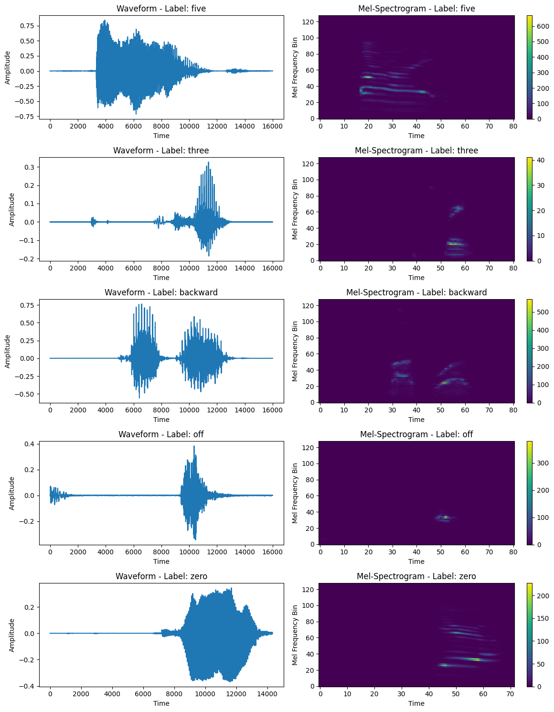
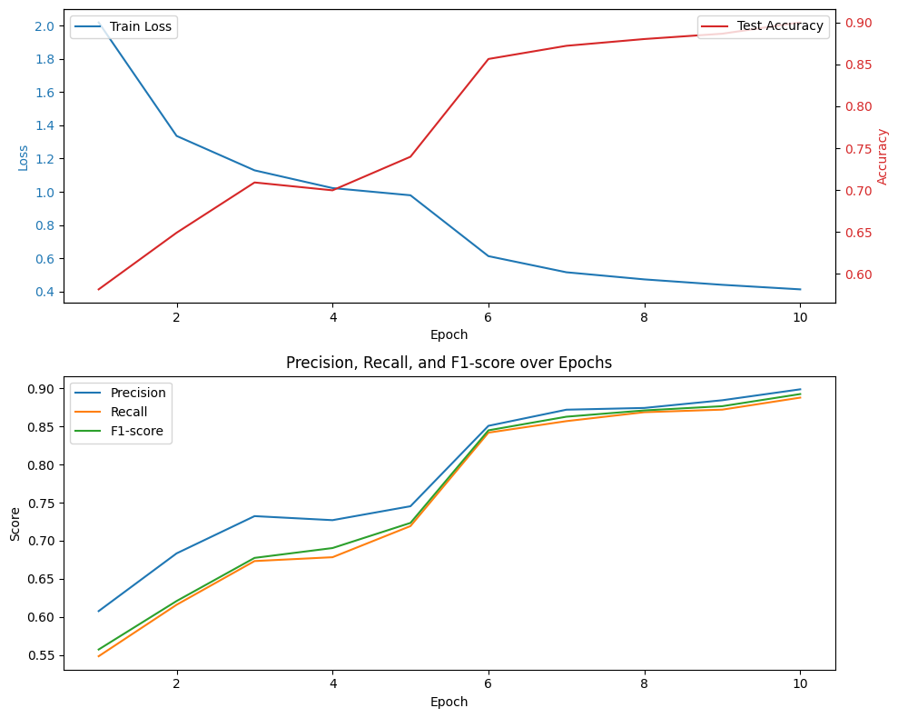

## 목차
1. [Analysis](#Analysis)
2. [Project](#Project)

# Analysis
[Analysis of Attention is all you need](https://arxiv.org/abs/1706.03762)

*"Attention Is All You Need"* (2017) introduces the Transformer model, a neural network architecture that replaces recurrent layers with self-attention mechanisms, significantly improving performance in natural language processing (NLP) tasks.   

* `Self-Attention Mechanism` – The model processes input sequences in parallel, using scaled dot-product attention to capture dependencies across words regardless of their distance.

$$
\text{Attention}(Q, K, V) = \text{softmax} \left(\frac{QK^T}{\sqrt{d_k}}\right) V
$$

* `Multi-Head Attention` – Multiple attention mechanisms run in parallel, allowing the model to focus on different parts of the input simultaneously.   

* `Positional Encoding` – Since Transformers lack recurrence, they use positional encodings to maintain word order information.   

- Positional Encoding (PE) consists of fixed values added to the input embeddings,  
calculated using sine and cosine functions for each position.

$$
PE_{(pos, 2i)} = \sin\left(\frac{pos}{10000^{\frac{2i}{d_{model}}}}\right)
$$

$$
PE_{(pos, 2i+1)} = \cos\left(\frac{pos}{10000^{\frac{2i}{d_{model}}}}\right)
$$

**Explanation of Variables**
| Variable | Description |
|----------|------------|
| \(pos\) | Position of the token in the sequence |
| \(i\) | Index of the embedding dimension |
| \(d_{model}\) | Total embedding dimension size |
| \(10000\) | Scaling factor to normalize position values |

```py
# PyTorch
def positional_encoding(max_len, d_model):
    pe = torch.zeros(max_len, d_model)
    position = torch.arange(0, max_len, dtype=torch.float32).unsqueeze(1)
    div_term = torch.exp(torch.arange(0, d_model, 2, dtype=torch.float32) * (-np.log(10000.0) / d_model))
    
    pe[:, 0::2] = torch.sin(position * div_term)  # 짝수 인덱스 (sin)
    pe[:, 1::2] = torch.cos(position * div_term)  # 홀수 인덱스 (cos)
    
    return pe
```

* Encoder-Decoder Structure – 
    The model consists of:   
        Encoder: Processes input sequences using stacked `self-attention` and `feed-forward layers`.   
        Decoder: Generates output sequences using `self-attention`, `encoder-decoder attention`, and `feed-forward layers`.   

* Improved Efficiency – Unlike RNNs, which process sequences sequentially, Transformers use parallelization, leading to faster training and better scalability.   



---

# Project

## 📊 Speech Command Recognition with Transformer

**This project uses only the encoder of the transformer to classify speech command.**

This repository provides an example implementation of a Transformer-based speech command recognition model using PyTorch and torchaudio. It covers the complete pipeline to download, preprocess the Speech Commands dataset, train a Transformer model, and evaluate its performance.

## 🚀 Key Features
- **Dataset Loading**: Implements a custom `SubsetSC` class that extends `torchaudio.datasets.SPEECHCOMMANDS` to selectively load training, validation, or testing subsets.
- **Feature Extraction**: Converts raw audio signals into Mel-spectrograms to use as input features.
- **Model Architecture**: Implements a `SpeechTransformer` model using a Transformer Encoder for speech command classification.
- **Training & Evaluation**: Trains the model for 10 epochs and achieves approximately 80% accuracy on the test set.

## ✅ Requirements
- Python 3.6+
- [PyTorch](https://pytorch.org/)
- [torchaudio](https://pytorch.org/audio/stable/index.html)

## ✅ Installation

### Repository Clone

```bash
git clone https://github.com/MachuEngine/SpeechCommandTransformer.git
```
### Required Packages

Install the required packages:
```bash
pip install -r requirements.txt
```


## 📰 Usage
1. Clone the repository and navigate to the project directory.
2. Run the script to start training and evaluation:
python main.py

The script will automatically download the Speech Commands dataset, start model training, and then evaluate the model on the test set.

## ✨ Code Overview

### 1. Dataset Class: `SubsetSC`
The `SubsetSC` class extends the `SPEECHCOMMANDS` dataset to selectively load subsets of the data:
- **Training Set**: Excludes validation and testing files.
- **Validation/Testing Set**: Loads files based on predefined file lists.

### 2. Model Architecture: `SpeechTransformer`
The Transformer-based model processes Mel-spectrogram features through the following steps:
- **Input Projection**: Projects input features to the desired model dimension.
- **Transformer Encoder**: Stacks multiple encoder layers to learn complex feature representations.
- **Classifier**: Maps the encoded features to class logits for classification.

```py
class SpeechTransformer(nn.Module):
    def __init__(self, input_dim, num_classes, d_model=128, nhead=8, num_layers=4, dim_feedforward=512, dropout=0.1):
        super(SpeechTransformer, self).__init__()
        self.input_projection = nn.Linear(input_dim, d_model)
        encoder_layer = nn.TransformerEncoderLayer(
            d_model=d_model, 
            nhead=nhead, 
            dim_feedforward=dim_feedforward, 
            dropout=dropout
        )
        self.transformer_encoder = nn.TransformerEncoder(encoder_layer, num_layers=num_layers)
        self.classifier = nn.Linear(d_model, num_classes)
        
    def forward(self, x):
        out = self.input_projection(x) 
        out = out.transpose(0, 1) 
        out = self.transformer_encoder(out) 
        out = out.mean(dim=0) 
        logits = self.classifier(out) 
        return logits
```

### 3. Training Pipeline
- **Data Preprocessing**: Converts audio waveforms to Mel-spectrograms, averages across channels, transposes dimensions, and pads sequences to form batches.
- **Loss Function and Optimizer**: Uses CrossEntropyLoss and Adam optimizer for training.
- **Training Loop**: Runs for 10 epochs, printing the average loss for each epoch.

### 4. Evaluation
The `evaluate` function calculates model accuracy on the test set.

## ⚛️ Training and Evaluation Results

*Changes to improve voice classification performance*

- Added Positional Encoding
- Improved evaluation function
- Separated learning and evaluation functions
- Added data sample visualization
- Added learning and evaluation result visualization
- Added and imported required libraries



| Epoch | Precision (%) | Recall (%) | F1-score (%) |
|--------|------------|------------|------------|
| 1 | 60.77 | 54.85 | 55.74 |
| 2 | 68.35 | 61.61 | 62.10 |
| 3 | 73.23 | 67.34 | 67.75 |
| 4 | 72.70 | 67.84 | 69.04 |
| 5 | 74.53 | 71.92 | 72.34 |
| 6 | 85.07 | 84.18 | 84.48 |
| 7 | 87.19 | 85.69 | 86.27 |
| 8 | 87.42 | 86.86 | 87.09 |
| 9 | 88.43 | 87.19 | 87.65 |
| 10 | 89.86 | 88.77 | 89.24 |



### **1️⃣ Training Performance Analysis**

#### ✅ Loss Reduction Trend
- **Initial Loss**: **2.0199** → **Final Loss**: **0.4126**
- The loss decreases rapidly in the first few epochs and stabilizes after **Epoch 6**.
- **Significant drop from Epoch 1 to Epoch 6**, indicating fast convergence.
- The continuous decrease in loss suggests effective learning.

#### ✅ Accuracy Improvement Trend
- **Initial Accuracy**: **58.16%** → **Final Accuracy**: **90.01%**
- Accuracy shows **steady growth**, reaching over **85% by Epoch 6**.
- **Slower increase after Epoch 6**, indicating near-convergence.

**➡ The model is learning effectively, with loss decreasing and accuracy improving consistently.**

- **Precision, Recall, and F1-score improve consistently throughout training.**
- **Early epochs show a large gap between Precision and Recall, but the gap narrows after Epoch 6.**
- **All metrics surpass 85% after Epoch 6, indicating strong performance and model generalization.**

✅ **The model successfully converges after Epoch 6, achieving high performance across all metrics.**  
✅ **Loss reduction and accuracy improvement indicate effective learning and training stability.**  
✅ **Precision, Recall, and F1-score remain balanced, suggesting that the model does not overly favor one aspect of evaluation.**  
